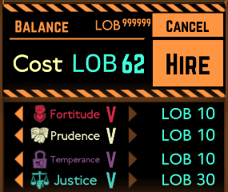

# Unlimited LOB Points & Agents

A mod for Lobotomy Corporation that removes agent hiring limits and locks LOB points to 999,999.

Requires BaseMod 5.0!
### Key Features

* Unlimited LOB Points: Locks your LOB point balance to 999,999 (displayed as ∞).
* Unlimited Agent Hiring: Bypasses daily agent hiring quota limits, enabling continuous agent recruitment on any day.
* High Mod Compatibility: Utilizes Harmony execution priority hooks (First/Last) to remain functional alongside death penalty or quota restriction mods.
* Framework Stability: Compiled against .NET Framework 4.7.2 to ensure native compatibility with Unity Mono.

## Previews

## Installation

1. Download the latest `UnlimitedLOBPoints.zip` release.
2. Extract the `UnlimitedLOBPoints` directory into your game folder:
   `LobotomyCorp_Data\BaseMods\UnlimitedLOBPoints\`
3. Launch Lobotomy Corporation.

## Requirements

* Lobotomy Corporation
* BaseMod 5.0 or higher

### Prerequisites
* .NET 8 SDK or .NET Framework 4.7.2 compiler
* Lobotomy Corporation with BaseMod 5.0 installed
